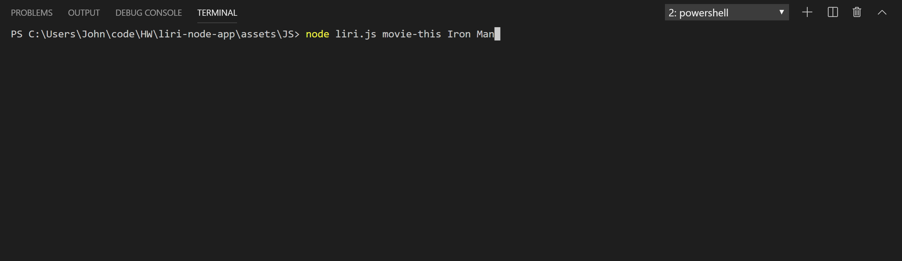
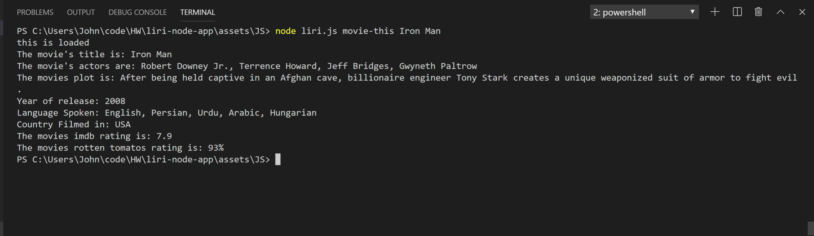

# liri-node-app
an app that takes in input through the console and displays information depending on the search terms.

## H1 Liri-node-app Commands-------------

Within this app there are four general commands to utilize They are as follows:

**concert-this -**

         * This will search the Bands in Town Artist Events API for an artist you search and render the following information about each event to the terminal:

     * Name of the venue

     * Venue location

     * Date of the Event 

 **spotify-this-song -**

     * This will show the following information about the song you type in your terminal/bash window

     * Artist(s)

     * The song's name

     * A preview link of the song from Spotify

     * The album that the song is from

   * If no song is provided then your program will default to "The Sign" by Ace of Base.


**movie-this-**

    * This will output the following information to your terminal/bash window about the movie you have entered:

     ```
       * Title of the movie.
       * Year the movie came out.
       * IMDB Rating of the movie.
       * Rotten Tomatoes Rating of the movie.
       * Country where the movie was produced.
       * Language of the movie.
       * Plot of the movie.
       * Actors in the movie.
    
       * If the user doesn't type a movie in, the program will output data for the movie 'Mr. Nobody.'
       ```

  **do-what-it-says-**

    Using the `fs` Node package, LIRI will take the text inside of random.txt and then use it to call one of LIRI's commands.

     * It will run `spotify-this-song` for "I Want it That Way," as follows the text in `random.txt`.

     ------------------------------------------------------------------------------------------------------------

## H1 How to enter commands --------------

within the terminal the command syntax must look like as follows:

**node liri.js "YOURE COMMAND HERE" "YOUR ARTIST/MOVIE NAME/SONG TITLE HERE"**

example:

This example is using the movie-this command, change your command to fit your use case


 **terminal command input screenshot:**



**terminal result screenshot**




